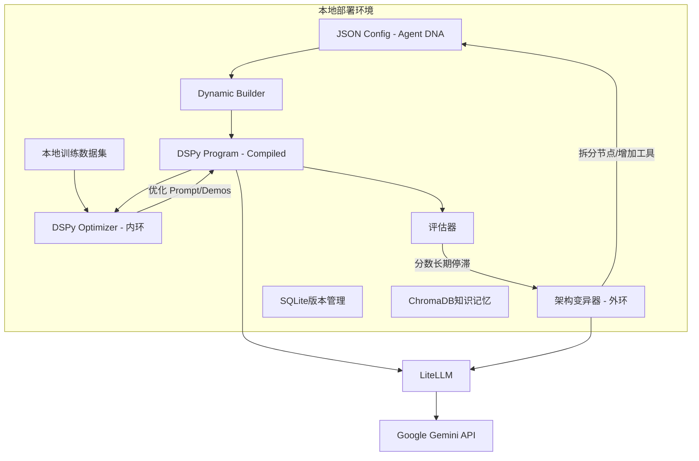

# EvoForgePlus —— 数据驱动的Agent持续进化平台

## 一、项目需求及思路

### 1.1. 项目概述 (Project Overview)

**EvoForgePlus** 是一个面向开发者的本地化 Agent 开发与优化平台。它的核心愿景是**“将 Agent 的构建从‘手工雕刻’转变为‘自动进化’”**。

该项目旨在解决当前 LLM 应用开发中 Prompt 工程难以维护、效果难以量化、优化依赖人工经验的痛点。通过引入“数据集驱动”和“反馈闭环”机制，系统能够在**不微调 LLM 模型参数（Weight-Frozen）** 的前提下，自动优化 Agent 的**提示词（Prompts）、少样本案例（Few-Shots）、工具配置（Tools）、知识库（Knowledge Base）以及团队架构（Team Architecture）**，实现 Agent 能力的自我迭代与提升。

### 1.2. 核心设计理念 (Core Philosophy)

1. **Code-as-Configuration (代码即配置):** Agent 不是一段固定的 Python 代码，而是一个动态的 JSON 配置对象（Agent DNA）。
2. **Data-Driven Optimization (数据驱动优化):** 效果好坏由测试集（Dataset）和评估器（Evaluator）说了算，而非开发者的直觉。
3. **Optimization over Fine-tuning (优化优于微调):** 避开昂贵且复杂的模型微调，专注于优化上下文（Context）、流程（Workflow）和工具描述（Tool Descriptions）。
4. **Stand on Giants (站在巨人肩膀上):** 深度集成 **DSPy** 框架，复用其成熟的 Module、Signature 和 Teleprompter（优化器）机制，通过 **LiteLLM** 统一接口标准。

### 1.3. 解决的痛点 (Pain Points Addressed)

- **手工调优的低效性:** 传统的 Prompt Engineering 需要反复试错，耗时且难以复现。
- **无法自适应:** 当业务逻辑变更或 API 接口更新时，静态 Agent 容易失效，需要重写代码。
- **扩展性瓶颈:** 简单的 Agent 难以处理复杂任务，但人工设计多 Agent 协作流程复杂度极高。
- **知识利用率低:** 难以确定哪些 Few-Shot 案例对当前任务最有效，RAG 检索效果依赖经验配置。

### 1.4. 系统架构与进化机制 (System Architecture & Evolution)

系统采用 **“双层进化环” (Dual-Loop Evolution)** 架构：

#### 1.4.1. 内环进化 (The Inner Loop - DSPy Native)

- **目标:** 在 Agent 架构不变的情况下，最大化当前配置的潜力。
- **优化对象:** System Prompt（指令）、Few-Shot Examples（演示案例）。
- **技术实现:** 利用 DSPy 的 Teleprompter (如 BootstrapFewShot, MIPRO)。
- **流程:**
  1. 运行训练集。
  2. 评估器打分。
  3. 筛选高分 Trace，生成 Few-Shot。
  4. LLM 分析低分 Case，重写 Instruction。

#### 1.4.2. 外环进化 (The Outer Loop - Architecture Search)

- **目标:** 当内环优化达到瓶颈时，改变 Agent 的结构以突破能力上限。
- **优化对象:** Agent 拓扑结构（单体 vs 团队）、工具挂载、知识库索引策略。
- **技术实现:** 元 Agent (Meta-Agent) + 架构变异算法。
- **流程:**
  1. 监控内环的评估分数曲线，若长期停滞。
  2. Meta-Agent 分析失败原因（如“缺乏外部信息”或“逻辑过于复杂”）。
  3. **变异操作:**
     - **分裂:** 将“通用助手”拆分为“规划者”+“执行者”。
     - **增强:** 挂载新的 Tool（如搜索工具）或 RAG 知识库。
  4. 生成新的 Agent DNA (JSON)，重启内环优化。


## 二、详细设计方案

### 2.1、 系统架构概览：双层进化环

我们需要构建两个闭环，这也是区别于普通 DSPy 项目的核心：

1.  **内环 (Inner Loop - DSPy Native):** 在架构不变的情况下，利用 DSPy 的 `Teleprompter` (如 MIPROv2, BootstrapFewShot) 自动优化 Prompt 和 Few-Shot 样本。
2.  **外环 (Outer Loop - Structural Mutation):** 当内环优化达到瓶颈时，通过“元Agent”修改系统的 JSON 配置（如增加 Agent 节点、挂载新工具），然后触发新一轮的内环优化。



---

### 2.2、 技术栈选型 (完全本地化 + 低成本)

*   **编程语言:** Python 3.10+
*   **核心框架:** **DSPy** (必须深度集成，利用其 Signature, Module, Teleprompter)。
*   **LLM 网关:** **LiteLLM** (统一调用 Gemini，方便未来切本地模型)。
*   **向量数据库:** **ChromaDB** (轻量级，本地文件存储，用于 RAG 和 Few-shot 检索)。
*   **关系数据库:** **SQLite** (存储 Config 版本、运行日志、评估结果)。
*   **应用接口:** 纯 Python 脚本或 **Streamlit** (快速构建可视化控制台)。

---

### 2.3、 核心模块详细设计

#### 2.3.1. 基础设施层：LiteLLM 与 DSPy 的融合

DSPy 默认支持 OpenAI，我们需要编写一个适配器来通过 LiteLLM 调用 LLM。

#### 2.3.2. 数据层：Agent DNA (JSON Schema)

这是实现“架构进化”的关键。不能写死 Class，必须用 JSON 定义结构，然后动态生成 DSPy Module。

```json
{
  "agent_id": "poem_master_v2",
  "start_node": "generator",
  "nodes": {
    "generator": {
      "type": "ChainOfThought",
      "signature": "topic -> content",
      "instruction": "你是一个新手诗人，会犯押韵错误。根据主题写一首四行诗。"
    },
    "critic": {
      "type": "ChainOfThought",
      "signature": "content, topic -> critique, decision",
      "instruction": "你是一个严格的文学评论家。检查这首诗是否符合主题，是否押韵。如果是好诗，decision 输出 'PASS'；如果需要修改，decision 输出 'FAIL' 并给出 critique 意见。请只输出单词 PASS 或 FAIL。"
    },
    "refiner": {
      "type": "ChainOfThought",
      "signature": "content, critique -> content",
      "instruction": "你是一个编辑。根据评论家的意见修改这首诗。直接输出修改后的诗句。"
    }
  },
  "flow": {
    "generator": {
      "next": "critic"
    },
    "critic": {
      "type": "branch",
      "source_var": "decision",
      "branches": {
        "PASS": "end",
        "FAIL": "refiner"
      },
      "default": "end"
    },
    "refiner": {
      "next": "critic" 
    }
  }
}
```

#### 2.3.3. 核心引擎：Dynamic DSPy Module Builder

这个类负责读取 JSON 并“编译”成一个可运行的 DSPy Module。

#### 2.3.4. 优化器层 (The Evolution)

**A. 内环 (基于 DSPy):**
直接复用 DSPy 强大的 `MIPROv2` 或 `BootstrapFewShotWithRandomSearch`。

**B. 外环 (架构变异):**
这是你需要自己写的逻辑。

*   **输入:** 运行日志、Bad Case 列表、当前 JSON Config。
*   **处理器:** 一个专门的 `ArchitectLLM` (Gemini)。
*   **Prompt 策略:**
    > "当前 Agent 处理以下任务失败率高（附带 Bad Case）。当前架构为（JSON）。请分析原因。如果是逻辑太复杂，请建议将 'planner' 节点拆分为 'researcher' 和 'writer'。如果是缺乏知识，请建议挂载知识库。请返回修改后的 JSON Config。"

---

### 2.4、 落地实施 Roadmap

作为个人开发者，建议分三步走，不要试图一步到位。

#### 第一阶段：最小闭环 (v0.1)
*   **目标:** 实现配置化 Agent + DSPy 自动 Prompt/Few-Shot 优化。
*   **实现:**
    1.  搭建 LiteLLM + Gemini 环境。
    2.  定义简单的 Single Node JSON Config。
    3.  编写 `DynamicAgent` 类，只支持 `dspy.ChainOfThought`。
    4.  接入 `dspy.BootstrapFewShot`。
*   **成果:** 你输入一个 Prompt 和 10 个问答对，系统自动给你吐出一个效果更好的、带有 Few-Shot 的 Agent。

#### 第二阶段：工具与知识库 (v0.2)
*   **目标:** Agent 可以使用工具，并能通过优化器调整工具描述。
*   **实现:**
    1.  在 `DynamicAgent` 中引入 `dspy.ReAct`。
    2.  建立 `ToolRegistry` (简单的 Python 函数装饰器)。
    3.  **创新点:** 在优化阶段，如果工具调用经常出错，让 LLM 自动重写 Python 工具函数的 Docstring（这会直接影响 ReAct 的效果）。

#### 第三阶段：多 Agent 架构进化 (v1.0)
*   **目标:** 自动拆分 Agent。
*   **实现:**
    1.  完善“外环”逻辑。
    2.  实现“元 Agent”：读取 Evaluation Report，决定是继续微调 Prompt (内环) 还是修改 JSON 结构 (外环)。
    3.  实现简单的 DAG 流程控制器。
