# EvoForgePlus —— 数据驱动的Agent持续进化平台

## 一、项目需求及思路

### 1.1. 项目概述 (Project Overview)

**EvoForgePlus** 是一个面向开发者的本地化 Agent 开发与优化平台。它的核心愿景是**“将 Agent 的构建从‘手工雕刻’转变为‘自动进化’”**。

该项目旨在解决当前 LLM 应用开发中 Prompt 工程难以维护、效果难以量化、优化依赖人工经验的痛点。通过引入“数据集驱动”和“反馈闭环”机制，系统能够在**不微调 LLM 模型参数（Weight-Frozen）** 的前提下，自动优化 Agent 的**提示词（Prompts）、少样本案例（Few-Shots）、工具配置（Tools）、知识库（Knowledge Base）以及团队架构（Team Architecture）**，实现 Agent 能力的自我迭代与提升。

### 1.2. 核心设计理念 (Core Philosophy)

1. **Code-as-Configuration (代码即配置):** Agent 不是一段固定的 Python 代码，而是一个动态的 JSON 配置对象（Agent DNA）。
2. **Data-Driven Optimization (数据驱动优化):** 效果好坏由测试集（Dataset）和评估器（Evaluator）说了算，而非开发者的直觉。
3. **Optimization over Fine-tuning (优化优于微调):** 避开昂贵且复杂的模型微调，专注于优化上下文（Context）、流程（Workflow）和工具描述（Tool Descriptions）。
4. **Stand on Giants (站在巨人肩膀上):** 深度集成 **DSPy** 框架，复用其成熟的 Module、Signature 和 Teleprompter（优化器）机制，通过 **LiteLLM** 统一接口标准。

### 1.3. 解决的痛点 (Pain Points Addressed)

- **手工调优的低效性:** 传统的 Prompt Engineering 需要反复试错，耗时且难以复现。
- **无法自适应:** 当业务逻辑变更或 API 接口更新时，静态 Agent 容易失效，需要重写代码。
- **扩展性瓶颈:** 简单的 Agent 难以处理复杂任务，但人工设计多 Agent 协作流程复杂度极高。
- **知识利用率低:** 难以确定哪些 Few-Shot 案例对当前任务最有效，RAG 检索效果依赖经验配置。

### 1.4. 系统架构与进化机制 (System Architecture & Evolution)

系统采用 **“双层进化环” (Dual-Loop Evolution)** 架构：

#### 1.4.1. 内环进化 (The Inner Loop - DSPy Native)

- **目标:** 在 Agent 架构不变的情况下，最大化当前配置的潜力。
- **优化对象:** System Prompt（指令）、Few-Shot Examples（演示案例）。
- **技术实现:** 利用 DSPy 的 Teleprompter (如 BootstrapFewShot, MIPRO)。
- **流程:**
  1. 运行训练集。
  2. 评估器打分。
  3. 筛选高分 Trace，生成 Few-Shot。
  4. LLM 分析低分 Case，重写 Instruction。

#### 1.4.2. 外环进化 (The Outer Loop - Architecture Search)

- **目标:** 当内环优化达到瓶颈时，改变 Agent 的结构以突破能力上限。
- **优化对象:** Agent 拓扑结构（单体 vs 团队）、工具挂载、知识库索引策略。
- **技术实现:** 元 Agent (Meta-Agent) + 架构变异算法。
- **流程:**
  1. 监控内环的评估分数曲线，若长期停滞。
  2. Meta-Agent 分析失败原因（如“缺乏外部信息”或“逻辑过于复杂”）。
  3. **变异操作:**
     - **分裂:** 将“通用助手”拆分为“规划者”+“执行者”。
     - **增强:** 挂载新的 Tool（如搜索工具）或 RAG 知识库。
  4. 生成新的 Agent DNA (JSON)，重启内环优化。


## 二、详细设计方案

### 2.1、 系统架构概览：双层进化环

我们需要构建两个闭环，这也是区别于普通 DSPy 项目的核心：

1.  **内环 (Inner Loop - DSPy Native):** 在架构不变的情况下，利用 DSPy 的 `Teleprompter` (如 MIPROv2, BootstrapFewShot) 自动优化 Prompt 和 Few-Shot 样本。
2.  **外环 (Outer Loop - Structural Mutation):** 当内环优化达到瓶颈时，通过“元Agent”修改系统的 JSON 配置（如增加 Agent 节点、挂载新工具），然后触发新一轮的内环优化。

```mermaid
graph TD
    subgraph Local_Environment [本地部署环境]
        Config[JSON Config - Agent DNA] --> Builder[Dynamic Builder]
        Builder --> Program[DSPy Program - Compiled]
        
        Data[本地训练数据集] --> InnerOpt[DSPy Optimizer - 内环]
        Program --> InnerOpt
        InnerOpt --> |优化 Prompt/Demos| Program
        
        Program --> Evaluator[评估器]
        Evaluator --> |分数长期停滞| MetaAgent[架构变异器 - 外环]
        MetaAgent --> |拆分节点/增加工具| Config
        
        DB[SQLite版本管理]
        VectorDB[ChromaDB知识记忆]
    end
    
    Program --> LiteLLM
    MetaAgent --> LiteLLM
    LiteLLM --> GeminiCloud[Google Gemini API]
```



---

### 2.2、 技术栈选型 (完全本地化 + 低成本)

*   **编程语言:** Python 3.10+
*   **核心框架:** **DSPy** (必须深度集成，利用其 Signature, Module, Teleprompter)。
*   **LLM 网关:** **LiteLLM** (统一调用 Gemini，方便未来切本地模型)。
*   **向量数据库:** **ChromaDB** (轻量级，本地文件存储，用于 RAG 和 Few-shot 检索)。
*   **关系数据库:** **SQLite** (存储 Config 版本、运行日志、评估结果)。
*   **应用接口:** 纯 Python 脚本或 **Streamlit** (快速构建可视化控制台)。

---

### 2.3、 核心模块详细设计

#### 2.3.1. 基础设施层：LiteLLM 与 DSPy 的融合

DSPy 默认支持 OpenAI，我们需要编写一个适配器来通过 LiteLLM 调用 Gemini。

```python
# infrastructure/llm_provider.py
import dspy
import litellm
import os

class LiteLLM_Wrapper(dspy.LM):
    def __init__(self, model_name, **kwargs):
        super().__init__(model=model_name)
        self.provider = "gemini" # 或其他
        self.kwargs = kwargs

    def __call__(self, prompt, **kwargs):
        # 融合默认参数和调用时参数
        params = {**self.kwargs, **kwargs}
        messages = [{"role": "user", "content": prompt}]
        
        response = litellm.completion(
            model=self.model,
            messages=messages,
            **params
        )
        # 提取文本，DSPy 需要返回 list of strings
        return [response.choices[0].message.content]

    # 实现 DSPy 需要的 inspect_history 等辅助方法...

# 初始化单例
def init_dspy():
    gemini = LiteLLM_Wrapper(model="gemini/gemini-1.5-pro", temperature=0.7)
    dspy.settings.configure(lm=gemini)
```

#### 2.3.2. 数据层：Agent DNA (JSON Schema)

这是实现“架构进化”的关键。不能写死 Class，必须用 JSON 定义结构，然后动态生成 DSPy Module。

```json
{
  "agent_id": "math_solver_v3",
  "version": 3,
  "nodes": {
    "planner": {
      "type": "ChainOfThought", // 映射到 dspy.ChainOfThought
      "signature": "question -> plan", // dspy signature 字符串
      "tools": [],
      "instruction": "拆解数学问题步骤..." // 初始 System Prompt
    },
    "calculator": {
      "type": "ReAct", // 映射到 dspy.ReAct
      "signature": "plan -> answer",
      "tools": ["python_repl"],
      "instruction": "执行计算..."
    }
  },
  "workflow": [
    "input -> planner",
    "planner.plan -> calculator.plan",
    "calculator.answer -> output"
  ]
}
```

#### 2.3.3. 核心引擎：Dynamic DSPy Module Builder

这个类负责读取 JSON 并“编译”成一个可运行的 DSPy Module。

```python
# engine/dynamic_agent.py
import dspy

class DynamicAgent(dspy.Module):
    def __init__(self, config):
        super().__init__()
        self.config = config
        self.sub_modules = {}
        
        for node_name, node_cfg in config['nodes'].items():
            # 1. 动态构建 Signature
            signature = dspy.Signature(node_cfg['signature'])
            signature.__doc__ = node_cfg['instruction'] # 将 Instruction 注入 Signature
            
            # 2. 实例化 DSPy 模块
            if node_cfg['type'] == 'ChainOfThought':
                module = dspy.ChainOfThought(signature)
            elif node_cfg['type'] == 'ReAct':
                # 这里需要加载工具函数列表
                tools = ToolRegistry.get(node_cfg['tools']) 
                module = dspy.ReAct(signature, tools=tools)
            
            # 3. 注册为当前模块的属性，这样 DSPy 优化器才能追踪到它
            self.__setattr__(node_name, module)
            self.sub_modules[node_name] = module

    def forward(self, **kwargs):
        context = kwargs
        # 根据 workflow 定义的简易逻辑流转数据 (此处简化为顺序执行)
        # 实际项目需要实现一个 DAG 解析器
        
        # 示例：假设是线性执行
        for node_name in self.sub_modules:
            module = getattr(self, node_name)
            # 自动匹配参数
            result = module(**context)
            # 更新上下文
            context.update(result)
            
        return context['answer'] # 假设最终输出叫 answer
```

#### 2.3.4. 优化器层 (The Evolution)

**A. 内环 (基于 DSPy):**
直接复用 DSPy 强大的 `MIPROv2` 或 `BootstrapFewShotWithRandomSearch`。

```python
from dspy.teleprompt import BootstrapFewShot

def run_inner_optimization(agent, trainset, metric_func):
    # 使用 DSPy 的优化器
    teleprompter = BootstrapFewShot(metric=metric_func, max_bootstrapped_demos=4)
    
    # 这一步会自动：
    # 1. 运行 agent
    # 2. 筛选高质量的 input/output 对
    # 3. 将其作为 few-shot 写入 agent 的 Prompt 中
    optimized_agent = teleprompter.compile(agent, trainset=trainset)
    return optimized_agent
```

**B. 外环 (架构变异):**
这是你需要自己写的逻辑。

*   **输入:** 运行日志、Bad Case 列表、当前 JSON Config。
*   **处理器:** 一个专门的 `ArchitectLLM` (Gemini)。
*   **Prompt 策略:**
    > "当前 Agent 处理以下任务失败率高（附带 Bad Case）。当前架构为（JSON）。请分析原因。如果是逻辑太复杂，请建议将 'planner' 节点拆分为 'researcher' 和 'writer'。如果是缺乏知识，请建议挂载知识库。请返回修改后的 JSON Config。"

---

### 2.4、 落地实施 Roadmap

作为个人开发者，建议分三步走，不要试图一步到位。

#### 第一阶段：最小闭环 (v0.1)
*   **目标:** 实现配置化 Agent + DSPy 自动 Prompt/Few-Shot 优化。
*   **实现:**
    1.  搭建 LiteLLM + Gemini 环境。
    2.  定义简单的 Single Node JSON Config。
    3.  编写 `DynamicAgent` 类，只支持 `dspy.ChainOfThought`。
    4.  接入 `dspy.BootstrapFewShot`。
*   **成果:** 你输入一个 Prompt 和 10 个问答对，系统自动给你吐出一个效果更好的、带有 Few-Shot 的 Agent。

#### 第二阶段：工具与知识库 (v0.2)
*   **目标:** Agent 可以使用工具，并能通过优化器调整工具描述。
*   **实现:**
    1.  在 `DynamicAgent` 中引入 `dspy.ReAct`。
    2.  建立 `ToolRegistry` (简单的 Python 函数装饰器)。
    3.  **创新点:** 在优化阶段，如果工具调用经常出错，让 LLM 自动重写 Python 工具函数的 Docstring（这会直接影响 ReAct 的效果）。

#### 第三阶段：多 Agent 架构进化 (v1.0)
*   **目标:** 自动拆分 Agent。
*   **实现:**
    1.  完善“外环”逻辑。
    2.  实现“元 Agent”：读取 Evaluation Report，决定是继续微调 Prompt (内环) 还是修改 JSON 结构 (外环)。
    3.  实现简单的 DAG 流程控制器。

---

### 2.5、 关键代码 Demo (可以直接运行的基础)

这是一个融合了 LiteLLM 和 DSPy 的最小 Demo，展示如何定义 Signature 并进行优化。

```python
import dspy
import litellm
from dspy.teleprompt import BootstrapFewShot

# 1. 配置 LiteLLM 适配器
class GeminiLM(dspy.LM):
    def __init__(self, model="gemini/gemini-1.5-flash"):
        super().__init__(model=model)
        os.environ["GEMINI_API_KEY"] = "YOUR_API_KEY" # 确保环境变量设置

    def __call__(self, prompt, **kwargs):
        try:
            response = litellm.completion(
                model=self.model,
                messages=[{"role": "user", "content": prompt}],
                **kwargs
            )
            return [response.choices[0].message.content]
        except Exception as e:
            print(f"Error: {e}")
            return [""]

# 2. 初始化
dspy.settings.configure(lm=GeminiLM())

# 3. 定义一个基于 Signature 的模块 (对应 Config 中的一个 Node)
class BasicGenerator(dspy.Module):
    def __init__(self):
        super().__init__()
        # 定义输入输出，这里对应 Config 中的 signature 字段
        self.prog = dspy.ChainOfThought("topic -> short_copy")
    
    def forward(self, topic):
        return self.prog(topic=topic)

# 4. 准备数据集 (用于驱动进化)
# 这里的 input 对应 signature 的 topic，output 对应 short_copy
train_data = [
    dspy.Example(topic="挂耳咖啡", short_copy="早八救星！这杯挂耳简直是液态精神，醇厚不酸，无限回购！☕️").with_inputs("topic"),
    dspy.Example(topic="人体工学椅", short_copy="老腰有救了！这把椅子像是长在背上一样，久坐不累，打工人必备。💺").with_inputs("topic"),
    # ... 添加更多数据
]

# 5. 定义评估指标 (Evaluation)
def validate_copy(example, pred, trace=None):
    # 简单规则：必须包含 emoji，长度在 10-50 字之间
    has_emoji = any(char in pred.short_copy for char in "☕️💺🔥✨")
    length_ok = 10 <= len(pred.short_copy) <= 50
    return has_emoji and length_ok

# 6. 运行优化器 (内环进化)
print("开始优化 Agent...")
teleprompter = BootstrapFewShot(metric=validate_copy, max_bootstrapped_demos=2)
optimized_agent = teleprompter.compile(BasicGenerator(), trainset=train_data)

# 7. 测试进化后的 Agent
print("\n测试结果:")
result = optimized_agent(topic="降噪耳机")
print(f"Topic: 降噪耳机")
print(f"Result: {result.short_copy}")

# 8. 查看优化后的 Prompt (包含自动生成的 Few-Shot)
# dspy.settings.lm.inspect_history(n=1)
```

### 2.6、 给开发者的特别建议

1.  **关于 DSPy 的学习曲线:** DSPy 的概念（Signature, Module, Teleprompter）一开始会有点绕。请务必把上面的 Demo 跑通，理解它通过 `compile` 方法修改 Agent 内部 `demos` 的原理。
2.  **LiteLLM 的坑:** 使用 Google Gemini 时，注意 LiteLLM 的版本更新，Google 的 API 策略（Vertex AI vs AI Studio）有时会变。LiteLLM 通常能很好地屏蔽差异。
3.  **不要过度设计 Workflow:** 在 v0.1 版本，只支持“单节点”或“简单的线性多节点”。不要一开始就写复杂的图执行引擎，那会让你陷入泥潭。

这个方案利用 DSPy 解决了最难的“Prompt 自动优化”部分，你只需要专注于构建“配置管理”和“架构变异”的逻辑，非常适合个人开发者落地。
