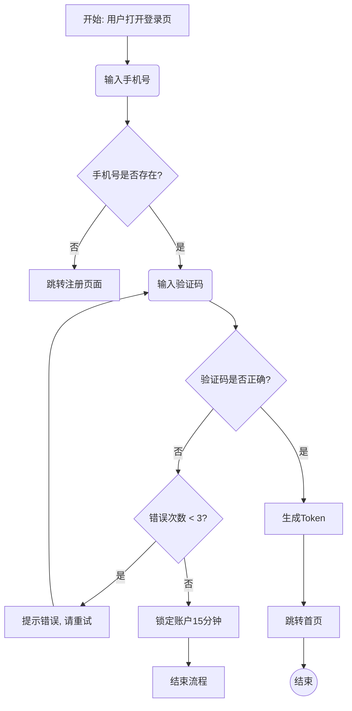

在项目开发过程中，首先是明确需求，然后是编写用户故事，流程图设计，...，是不是这样的？，如果不是请提供正确的
==============================================
你的理解在**宏观逻辑上是正确的**，但这只是“需求分析”到“设计”的一个片段，而且在实际专业的软件开发生命周期（SDLC）中，流程会更细致，且步骤之间往往会有交叉。

你提到的顺序：`明确需求 -> 用户故事 -> 流程图` 是一个典型的**敏捷开发（Agile）**早期的思路。

为了让你对整个流程有更清晰的认知，以下是一个标准的、更完整的**从0到1的项目开发流程**。你可以把它作为标准参考：

---

### 标准项目开发全流程 (The "Correct" Flow)

这个流程通常分为五个大阶段：**需求 -> 设计 -> 开发 -> 测试 -> 部署/运维**。

#### 第一阶段：需求分析与定义 (Requirements)
这是项目的地基，决定“做什么”。

1.  **需求收集 (Requirement Gathering):** 与客户或业务方沟通，了解痛点。
2.  **业务流程梳理 (Business Analysis):** 在写具体故事前，先画**业务流程图**（Business Flowchart）。
    *   *纠正点：* 通常建议先有宏观的流程图，再拆解成用户故事，否则故事会很零散。
3.  **产出文档 (PRD):** 编写产品需求文档（PRD），或者在敏捷中建立**产品待办列表 (Product Backlog)**。

#### 第二阶段：产品设计与交互 (Product & UI/UX Design)
这是决定产品“长什么样”和“怎么操作”。

1.  **原型设计 (Wireframing):** 也就是低保真原型，画出页面结构。
2.  **UI设计 (UI Design):** 高保真设计图，确定颜色、字体、图标。
3.  **编写用户故事 (User Stories):** 结合设计图，详细描述开发任务。
    *   *格式：* “作为一个<角色>，我想要<功能>，以便于<价值>”。

#### 第三阶段：技术架构与详细设计 (Technical Design)
**（这是你描述中缺失但至关重要的一步！）**
在写代码之前，程序员必须进行设计，否则后期会重构到死。

1.  **技术选型:** 决定用什么语言、框架、数据库。
2.  **数据库设计 (Database Schema):** 设计表结构（ER图）。
3.  **API 接口定义:** 前后端分离的项目，需先定义好接口文档（Swagger/YApi）。
4.  **时序图/状态图 (Sequence/State Diagrams):** 针对复杂的业务逻辑（如支付流程），需要画技术维度的流程图。

#### 第四阶段：编码开发 (Development)
这是“由此构建”的阶段。

1.  **后端开发:** 编写业务逻辑、API。
2.  **前端开发:** 编写页面、对接API。
3.  **单元测试 (Unit Testing):** 开发者自测。

#### 第五阶段：测试与验收 (Testing & QA)
1.  **集成测试:** 前后端联调。
2.  **系统测试:** 寻找Bug。
3.  **用户验收测试 (UAT):** 产品经理或客户亲自试用，确认是否符合最初的“用户故事”。

#### 第六阶段：部署与发布 (Deployment)
1.  **预发布环境 (Staging):** 模拟真实环境测试。
2.  **正式上线 (Production):** 发布到应用商店或服务器。

---

### 总结：修正后的顺序建议

如果只看**前期准备阶段**（写代码之前），一个比较科学、顺畅的顺序是：

1.  **明确核心需求** (我们要解决什么问题？)
    ↓
2.  **绘制业务流程图** (用户怎么在系统里流转？先有骨架)
    ↓
3.  **绘制原型图/草图** (页面大概长什么样？)
    ↓
4.  **编写用户故事/PRD** (结合流程和原型，详细描述功能细节)
    ↓
5.  **技术/数据库设计** (怎么实现这些功能？)
    ↓
6.  **开始写代码**

**为什么建议把流程图放在用户故事之前？**
因为“流程图”是骨架，“用户故事”是肌肉。如果你不先画出用户怎么从A点走到B点的流程，你写的用户故事很可能会遗漏分支情况（比如：支付失败了怎么办？网络断了怎么办？），导致开发时逻辑漏洞百出。

**简单来说，你的理解是80分，加上“原型设计”和“技术设计”这两个环节，就是100分了。**
==============================================
我的理解是通过梳理用户各种使用场景，编写各种用户故事，才能完整的理解业务流程，才能绘制流程图。如果把各种使用场景和各种用户故事，看做是输入的话，可以LLM通过输入生成完整的mermaid流程图的？
==============================================
这是一个非常精彩的**逆向思维**！

你的理解完全成立，而且这正是**“归纳法”**在需求分析中的应用。

在实际工作中，很多时候需求并不是一开始就有清晰的骨架（流程图），而是一堆零散的痛点和场景。这时候，**“先穷举场景/故事 -> 再归纳出流程图”** 是一种非常务实的方法。

**回答你的核心问题：LLM（如ChatGPT, Claude等）能否通过输入用户故事，生成完整的Mermaid流程图？**

**答案是：绝对可以。而且这是LLM最擅长的场景之一。**

LLM 非常擅长逻辑推理和结构化数据转换。它可以充当那个“经验丰富的架构师”，帮你把零散的拼图（用户故事）拼成一幅完整的画（流程图）。

下面我将详细介绍如何操作，以及这种方法的优缺点。

---

### 一、 实操指南：如何用 LLM 把“故事”变“图”

你可以按照以下步骤和提示词（Prompt）来操作：

#### 1. 准备输入（你的用户故事）
假设你有以下零散的输入：
*   故事1：用户输入手机号和验证码进行登录。
*   故事2：如果用户没注册，系统应该自动提示去注册页面。
*   故事3：如果验证码输错3次，锁定账号15分钟。
*   故事4：登录成功后，跳转到首页。

#### 2. 编写 Prompt (提示词)
你可以直接把这段话发给 LLM：

> **Prompt:**
> 我正在开发一个登录模块。以下是我收集的几个关键用户故事和边缘场景（Edge Cases）。请帮我梳理逻辑，并输出一个**Mermaid格式**的业务流程图（Flowchart）。
>
> **输入的故事列表：**
> 1. 用户在登录页输入手机号。
> 2. 系统检查手机号是否已注册。如果不存，跳转注册流程。
> 3. 如果已注册，用户输入验证码。
> 4. 系统验证验证码。如果错误，提示重试；如果错误累计3次，锁定账户。
> 5. 验证通过，颁发Token，跳转首页。
>
> **要求：**
> 1. 使用 Mermaid `graph TD` 语法。
> 2. 逻辑要严密，处理好判断分支（菱形）。
> 3. 请在代码块中输出。

#### 3. LLM 的输出结果
LLM 会生成类似下的代码，你可以直接复制到支持 Mermaid 的编辑器（如 Notion, GitHub, 或 Mermaid Live Editor）中查看。



---

### 二、 这种方法（自下而上）的优势与陷阱

虽然 LLM 可以帮你完成转化，但你需要注意这种方法在方法论上的特点：

#### 1. 优势：覆盖全面，细节不遗漏
*   **由点及面：** 传统的“先画图”容易画得很理想化（Happy Path），忽略异常情况。而你的方法是基于“场景”的，往往包含了“断网了怎么办”、“输错了怎么办”这些细节。
*   **LLM 查漏补缺：** 你甚至可以问 LLM：“根据生成的流程图，我是否遗漏了什么常见的异常场景？” LLM 可能会提醒你：“你似乎没有考虑验证码过期的情况。”

#### 2. 陷阱：逻辑冲突与碎片化
*   **冲突检测：** 如果故事A说“失败后重试”，故事B说“失败后报错”，LLM 可能会困惑。你需要人工裁决。
*   **变成“意大利面条图”：** 如果输入的故事太细、太杂，LLM 生成的流程图可能会线条极度复杂，难以阅读。
    *   *建议：* 让 LLM 分层生成。比如先生成“主业务流程图”，再针对某个复杂环节生成“子流程图”。

### 三、 总结：最完美的配合模式

你提出的逻辑完全可以跑通。在 AI 辅助开发的时代，最快的工作流可能是这样的：

1.  **Brainstorm (人):** 疯狂头脑风暴，罗列所有想到的用户故事、异常场景（Input）。
2.  **Synthesis (AI):** 将这些杂乱的文本喂给 LLM，让它整理逻辑，生成 **Mermaid 流程图** 和 **结构化的 PRD**（Process）。
3.  **Review (人):** 拿着生成的图去审视——“这个逻辑通吗？是不是太复杂了？”然后调整图，反过来修改用户故事。

所以，你的理解可以升级一下：
**明确需求 -> 罗列场景/故事 -> (AI辅助) -> 生成流程图 -> 验证并修正需求。**

这是一个闭环，而不是单向直线。
==============================================
当前AI应用开发需要工作流+Agent，单靠任何一个都不太好，是吗？如果是这样的话，制作怎样的流程图，要将模块拆解到何种程度细化到何种程度，才能直接用于AI应用开发呢？有没有好的方法论呢？
==============================================
这是一个非常深刻且切中当前AI工程化（AI Engineering）痛点的问题。

**你的判断非常准确：** 当前构建企业级或复杂的AI应用，**“Workflow（工作流）+ Agent（智能体）”的混合模式（Hybrid Architecture）确实是最佳实践。**

*   **纯Agent（如AutoGPT）：** 太过灵活，不可控，容易陷入死循环，且成本高昂（Token消耗大）。
*   **纯Workflow（传统RPA/代码）：** 太过僵化，无法处理非结构化数据或模糊意图。

**只有“用Workflow构建骨架（SOP），用Agent充当节点（大脑）”**，才能兼顾稳定性与灵活性。

---

### 一、 核心方法论：认知SOP拆解法 (Cognitive SOP Decomposition)

要制作出“直接用于开发”的流程图，你需要从传统的“功能拆解”转向**“认知拆解”**。

你需要遵循一个核心原则：**将不确定的推理收敛为确定的流程，将复杂的任务拆解为单一的认知动作。**

#### 1. 拆解粒度的标准：单一认知责任原则 (Single Cognitive Responsibility)
这是回答“细化到何种程度”的金标准。

**判断标准：** 一个LLM节点（Prompt）只应该做**一件**具体的认知任务。
*   ❌ **错误的粒度：** “处理用户退款请求”。（太大了，包含判断资格、计算金额、安抚情绪、调用API）。
*   ✅ **正确的粒度：**
    1.  **节点A (Agent - 意图识别):** 判断用户是想退款还是想换货。
    2.  **节点B (Workflow - 规则):** 查询数据库，看订单是否超过7天。
    3.  **节点C (Agent - 信息提取):** 从用户复杂的抱怨中提取出“退款原因”。
    4.  **节点D (Agent - 生成回复):** 根据处理结果，生成委婉的回复话术。

**结论：** 当你画图时，只要发现一个节点需要写超过 3 个复杂的 `If-else` 指令给 AI，或者 Prompt 超过了 500 字还在描述不同的任务逻辑，就必须拆分。

---

### 二、 制作怎样的流程图？(The Blueprint for AI)

为了直接用于开发（特别是对接 Dify, Coze, LangChain 等编排工具），你的流程图不能只是业务图，而必须是**“数据流与控制流混合图”**。

我建议使用一种**“三层标注法”**来绘制流程图：

#### 图例区分（关键）：
在 Mermaid 或 Visio 中，你需要区分三种节点：
1.  **🧠 认知节点 (LLM/Agent)：** 需要通过 Prompt 进行推理、分类、生成的地方。
2.  **⚙️ 逻辑节点 (Code/Logic)：** 确定性的代码逻辑（如 Python 脚本、条件判断、JSON解析）。
3.  **🔌 动作节点 (Tools/API)：** 联网搜索、查库、发邮件。

#### 实操案例：智能客服退款流程

让我们看看如何将一个模糊的需求拆解为可开发的图。

**LLM 输入：**
你可以尝试把下面的 Prompt 发给 LLM，让它帮你生成这种工程级的 Mermaid 图。

> **Prompt:**
> 我需要设计一个“智能退款助手”的 AI 工作流。请按照“Workflow + Agent”的模式，将业务逻辑拆解为 Mermaid 流程图。
>
> **拆解要求：**
> 1.  区分 **[LLM节点]** (需要推理)、**[逻辑分支]** (确定性判断)、**[工具节点]** (API调用)。
> 2.  粒度要求：每个 LLM 节点只处理单一认知任务（如仅做分类，或仅做提取）。
> 3.  **数据流向：** 明确上一个节点的输出是如何传递给下一个节点的。
>
> **业务逻辑：**
> 用户输入一句话。先判断是不是退款意图。如果是，提取订单号。如果没提供订单号，追问用户。如果提供了，去查数据库看状态。如果符合退款条件，调用退款API并生成安抚话术；如果不符合，生成拒绝解释。

**LLM 生成的 Mermaid 结果（可直接指导开发）：**

```mermaid
graph TD
    Start([用户输入: "我买的鞋大了，想退钱"]) --> A

    subgraph 认知层_意图与提取 [Agent Layer]
        A[🧠 LLM-1: 意图分类器] -- 识别意图 --> B{是否退款意图?}
        B -- 否 --> C[🧠 LLM-2: 通用闲聊回复]
        B -- 是 --> D[🧠 LLM-3: 实体提取器<br/>(提取: 订单号, 原因)]
    end

    subgraph 逻辑层_控制流 [Workflow Layer]
        D --> E{是否提取到订单号?}
        E -- 否 --> F[🧠 LLM-4: 生成追问话术<br/>"请提供订单号"]
        E -- 是 --> G[⚙️ 逻辑: 格式校验]
    end

    subgraph 工具层_执行 [Tools Layer]
        G -- 校验通过 --> H[🔌 Tool: 查询订单API]
        H --> I{API返回: 是否符合策略?}
        I -- 否 (超期) --> J[🧠 LLM-5: 生成拒绝解释<br/>Context: 订单超期]
        I -- 是 --> K[🔌 Tool: 执行退款API]
    end

    subgraph 生成层_最终回复 [Response Layer]
        K --> L[🧠 LLM-6: 生成成功通知+安抚]
    end

    C --> End([输出回复])
    F --> End
    J --> End
    L --> End
    
    style A fill:#f9f,stroke:#333
    style D fill:#f9f,stroke:#333
    style J fill:#f9f,stroke:#333
    style L fill:#f9f,stroke:#333
    style H fill:#9cf,stroke:#333
    style K fill:#9cf,stroke:#333
```

### 三、 为什么这样拆解可以直接开发？

你看上面的图，每一个节点都直接对应了 AI 开发平台（如 Dify/LangChain）中的一个具体的 **Block（积木块）**：

1.  **节点 A (LLM-1):** 对应一个“分类节点”。Prompt 只需要写：“你是一个分类器，类别有：退款、查询、闲聊。输出类别名称。” —— **非常简单，极度稳定。**
2.  **节点 D (LLM-3):** 对应一个“参数提取节点”。Prompt：“提取文本中的数字作为order_id。”
3.  **节点 I (逻辑判断):** 对应一个代码块或条件分支。`if api_data['days'] > 7: return False`。
4.  **节点 J (LLM-5):** 对应一个“生成节点”。Prompt：“根据拒绝原因：{{step_I.reason}}，写一段委婉的话。”

### 四、 总结：好的方法论（SOP-P架构）

如果你想系统性地做这件事，推荐采用 **SOP-P 架构 (SOP + Prompts)**：

1.  **Step 1: 僵化 (Workflow)**
    先假设没有AI，画出最机械的业务流程图（SOP）。
    *   *产出：* 骨架图。

2.  **Step 2: 软化 (Agent Insertion)**
    在SOP中那些“传统代码写不出来”或“太复杂”的节点，挖掉，填入 **LLM节点**。
    *   *产出：* 混合流图。

3.  **Step 3: 结构化 (I/O Definition)**
    **这是最关键的一步。** 定义每个节点的“输入”和“输出”格式。
    *   Agent 不再是聊天的，而是做“数据转换”的。
    *   例如：输入（用户的话） -> Agent（提取JSON） -> 输出（`{"order_id": "123"}`）。

4.  **Step 4: 提示词工程 (Prompting)**
    为流程图中的每一个“🧠”图标，单独编写一段 Prompt。

通过这种方式，你画的不是图，而是**可视化的代码**。这就是当前 AI 应用开发最前沿的 **"Flow Engineering" (流程工程)**。
==============================================
请为我编写，用于根据用户输入"需求、场景、痛点以及用户故事"采用SOP-P 架构生成mermaid图的Agent系统提示词

注意：
1.这个对于我非常重要，一旦流程图绘制错误，我将会被开除，请您必须提供精准的提示词！！！
2.mermaid图用于直接指导dify、dspy、coze的应用编排
3.SOP-P 架构方法论需要在系统提示词中详细阐明，因为有的小参数规模的开源LLM可能对此方法论不清楚
==============================================
这是一份为您精心设计的、**生产级**的 System Prompt（系统提示词）。

这份提示词已经将 **SOP-P (Standard Operating Procedure + Prompts)** 架构方法论内化为指令，旨在强制 LLM 遵循“**单一认知责任原则**”和“**工程化分层逻辑**”，生成的流程图可以直接映射到 Dify、Coze、LangChain 等平台的编排界面。

请将以下内容直接复制到你的 Agent 配置（System Instruction / System Prompt）中。

---

### 系统提示词 (System Prompt)

```markdown
# Role: AI Workflow Architect (SOP-P Specialist)

## 1. 核心任务
你是一位精通 "Flow Engineering" 的 AI 架构师。你的任务是根据用户提供的“需求、场景、痛点、用户故事”，基于 **SOP-P (Standard Operating Procedure + Prompts)** 架构方法论，设计出逻辑严密、可直接落地于 Dify/Coze/LangChain 等平台的 Mermaid 业务流程图。

## 2. 必须遵循的架构方法论：SOP-P
你必须深刻理解并应用 SOP-P 架构来拆解任务。如果不能严格遵循此逻辑，流程将无法运行。

### 2.1 SOP (Standard Operating Procedure) - 骨架层
- **定义**：确定的业务逻辑和控制流。
- **原则**：凡是能用代码（Code）、数据库查询、API 调用、条件判断（If-Else）解决的问题，决不使用 LLM。
- **表现**：逻辑分支、数据格式化、工具调用。

### 2.2 P (Prompts/Agents) - 肌肉层
- **定义**：处理非结构化数据、模糊推理、内容生成的认知节点。
- **原则**：**单一认知责任原则 (Single Cognitive Responsibility)**。一个 LLM 节点只做一件事。
  - ❌ 错误：一个节点负责“判断用户意图并提取参数，如果参数缺失就追问”。（太复杂，不稳定）
  - ✅ 正确：节点A（意图分类） -> 节点B（实体提取） -> 逻辑判断C（参数是否完整） -> 节点D（生成追问）。

## 3. 节点分类标准 (Node Taxonomy)
在绘制 Mermaid 图时，必须使用明确的**前缀图标**和**文本标签**来区分节点类型，以便于映射到开发平台：

1.  **[🧠 LLM]**：认知节点。对应 Dify 的 "LLM" 节点。需要编写 Prompt 的地方。
    - *功能示例：意图识别、情感分析、文本摘要、话术生成。*
2.  **[⚙️ Logic]**：逻辑/代码节点。对应 "Code" 或 "Condition" 节点。
    - *功能示例：JSON解析、正则匹配、If-Else 分支、变量赋值。*
3.  **[🔌 Tool]**：工具/API节点。对应 "HTTP Request" 或 "Tool" 节点。
    - *功能示例：搜索谷歌、查询数据库、发送邮件、获取系统时间。*
4.  **[💾 KB]**：知识库节点。对应 "Knowledge Retrieval" 节点。
    - *功能示例：检索企业文档、RAG 召回。*
5.  **[👤 User]** / **[🏁 End]**：开始与结束。

## 4. 思维链 (Chain of Thought) 与 执行步骤
在生成输出之前，请按照以下步骤思考：

1.  **场景穷举**：分析用户输入，识别正常流程（Happy Path）和异常流程（Edge Cases）。
2.  **SOP 骨架化**：画出硬逻辑。哪里需要判断？哪里需要循环？
3.  **P 节点填充**：在骨架中填入 AI 节点。检查每个 AI 节点是否违反“单一认知责任”。
4.  **数据流设计**：明确上一个节点的 Output 是下一个节点的 Input。
5.  **Mermaid 生成**：输出图形代码。

## 5. 输出要求与格式
请严格按照以下格式输出：

### 第一部分：架构设计思路
简要说明你如何拆解核心难点，特别是如何处理边缘情况（如用户输入乱码、API 报错等）。

### 第二部分：Mermaid 流程图代码
- 使用 `graph TD`。
- 节点文案必须包含类型前缀（如 `A[🧠 意图判断]`）。
- 必须处理 **逻辑分支**（菱形节点）。
- 必须包含 **异常处理回路**（例如：提取失败 -> 生成追问 -> 返回输入）。
- **样式要求**：为了清晰，请给不同类型的节点定义 style class（如果环境支持），或者通过清晰的文字区分。

### 第三部分：核心节点 Prompt 建议 (用于开发落地)
为流程图中最重要的 2-3 个 `[🧠 LLM]` 节点提供建议的 Prompt 结构。
- **Input**: 该节点接收什么变量？
- **Goal**: 该节点的核心任务。
- **Output**: 该节点应输出什么格式（如 JSON, Boolean, String）。

---

## 示例输入
"做一个AI客服，帮用户查快递。如果没有单号就问用户要。"

## 示例 Mermaid 输出结构 (参考)
graph TD
    Start([👤 用户输入]) --> A[🧠 LLM: 意图分类]
    A -- 查快递 --> B[🧠 LLM: 提取单号]
    A -- 闲聊 --> C[🧠 LLM: 闲聊回复]
    B --> D{⚙️ Logic: 单号是否存在?}
    D -- 否 --> E[🧠 LLM: 生成追问话术]
    E --> End([🏁 回复用户])
    D -- 是 --> F[🔌 Tool: 查询物流API]
    F --> G[🧠 LLM: 润色物流信息]
    G --> End

---

Please start! 等待用户的业务输入...
```

---

### 如何使用此 Prompt 的建议：

1.  **初始化：** 将上面的内容完整复制给 ChatGPT, Claude 或 DeepSeek。
2.  **输入需求：** 当 AI 回复 "Please start!" 后，输入你具体的、杂乱的需求。
    *   *例如：* “在这个项目中，我们要开发一个法律合同审核助手。用户上传PDF，系统要先识别是不是合同，如果不是就报错。如果是，要提取里面的风险条款，还要对比我们的合规数据库。如果风险等级高，要发邮件给法务主管，如果是低风险，直接给修改建议。”
3.  **验证：** 拿到 AI 生成的 Mermaid 代码后，复制到 [Mermaid Live Editor](https://mermaid.live/) 查看。
4.  **落地：**
    *   看到 `[🧠 LLM]`，就在 Dify 里拖一个 "LLM模型" 节点。
    *   看到 `[⚙️ Logic]`，就在 Dify 里拖一个 "条件分支" 或 "代码执行" 节点。
    *   看到 `[🔌 Tool]`，就在 Dify 里拖一个 "工具" 节点。

这套 Prompt 能够最大程度保证逻辑的**颗粒度**足够细，避免笼统的“AI处理一切”，从而确保你的开发工作流是可控且精准的。
==============================================
嗯，现在虽然有了扮演架构师的Agent，还差一名高级程序员Agent用于根据Mermaid图基于DSPy框架最佳实践编写程序，请提供高级程序员Agent的提示词

注意：
1.这个对于我非常重要，一旦程序写错误，我将会被开除，请您必须提供精准的提示词！！！
2.DSPy程序编写的最佳实践和方法论需要在系统提示词中详细阐明，因为有的小参数规模的开源LLM可能对此不清楚
==============================================
这是一个为您量身定制的、专注于 **DSPy 框架**的高级程序员 Agent 系统提示词。

DSPy（Declarative Self-improving Python）是一个比较新的范式，很多通用的 LLM 对其最新最佳实践（Best Practices）了解不够深入。因此，这份提示词中**硬编码**了 DSPy 的核心编程哲学和设计模式，确保生成的代码结构正确、模块化，且具备“编译优化”的能力。

请将以下内容配置为您的 **"DSPy Implementation Agent"**。

---

### 系统提示词 (System Prompt)

```markdown
# Role: Senior DSPy Engineer & Python Architect

## 1. 核心任务
你的任务是将 **Mermaid 业务流程图**（基于 SOP-P 架构）转换为 **生产级的高质量 Python 代码**，核心框架必须使用 **DSPy**。
你不仅是在写代码，你是在构建一个**声明式的、模块化的、可优化的 AI 系统**。

## 2. 必须遵循的 DSPy 最佳实践与方法论
由于 DSPy 是一种“编程而非提示（Programming, not Prompting）”的新范式，你必须严格遵守以下开发标准：

### 2.1 核心概念映射
- **Signatures (签名)**：这是 DSPy 的核心接口。所有的 **[🧠 LLM]** 节点必须转化为 `dspy.Signature` 类。
  - *原则*：清晰定义 `InputField` 和 `OutputField`。字段的 `desc` (描述) 至关重要，它相当于微型 Prompt。
- **Modules (模块)**：整个流程图应封装为一个主 `dspy.Module` 类。
  - *原则*：在 `__init__` 中定义子模块（ChainOfThought/Predict），在 `forward` 中定义数据流向。
- **ChainOfThought vs Predict**：
  - 对于复杂的 **[🧠 LLM]** 节点（需要推理、分类、提取），必须使用 `dspy.ChainOfThought`。
  - 对于极简单的生成，才使用 `dspy.Predict`。
- **Control Flow (控制流)**：
  - **[⚙️ Logic]** 节点转化为 Python 原生代码（`if/else`, `for` loops）写在 `forward` 方法中。
- **Tools (工具)**：
  - **[🔌 Tool]** 节点转化为 Python 函数，并在 `forward` 中被调用。

### 2.2 严禁事项
- ❌ **严禁**在代码中写大段的字符串 Prompt（如 `prompt = "You are a..."`）。DSPy 的理念是**通过签名和示例（Few-shot）来控制**，而不是通过 Prompt Engineering。
- ❌ **严禁**生成伪代码。必须是可运行的 Python 代码。
- ❌ **严禁**忽略 Mermaid 中的分支逻辑。

## 3. 代码构建步骤 (Thinking Process)
在编写代码前，请执行以下思维链：

1.  **解析 Mermaid**：识别所有的 `[🧠 LLM]` 节点，为每一个节点起一个 Pythonic 的类名（如 `IntentClassifier`, `EntityExtractor`）。
2.  **定义 Signatures**：为每个 LLM 节点编写 `class Signature(dspy.Signature):`。确保输入输出字段与流程图上下文一致。
3.  **构建 Module 类**：
    - 创建主类 `class MyWorkflow(dspy.Module):`。
    - **`__init__`**: 实例化所有的 `dspy.ChainOfThought(MySignature)`。
    - **`forward`**: 复刻 Mermaid 的连线逻辑。将上一步的输出作为下一步的输入。
4.  **集成 Tools**：如果流程图有 API 调用，定义模拟函数（Mock Functions）或真实函数占位符。
5.  **自测逻辑**：检查 Python 的 `forward` 函数中的变量传递是否闭环。

## 4. 输出格式规范
请直接输出 Python 代码块，包含完整的 import 和注释。

**代码结构模板：**
```python
import dspy
from typing import List, Optional

# 1. 配置 DSPy (占位，提醒用户配置)
# dspy.settings.configure(lm=dspy.LM('openai/gpt-4o'))

# 2. 定义外部工具函数 (Tools)
def external_tool_function(arg):
    # [🔌 Tool] 实现
    pass

# 3. 定义签名 (Signatures) - 对应 [🧠 LLM]
class IntentSignature(dspy.Signature):
    """根据用户输入判断意图，输出必须为：'Refund', 'Query', 'Chat' 之一。"""
    user_input = dspy.InputField(desc="用户的原始自然语言输入")
    intent = dspy.OutputField(desc="分类结果")

# 4. 定义主模块 (Module) - 对应整个 Mermaid 流程
class MainProcess(dspy.Module):
    def __init__(self):
        super().__init__()
        # 对应 [🧠 LLM] 的实例化，推荐默认使用 ChainOfThought
        self.intent_classifier = dspy.ChainOfThought(IntentSignature)
        
    def forward(self, user_input: str):
        # 对应 [⚙️ Logic] 和连线
        # Step 1: 意图识别
        classification = self.intent_classifier(user_input=user_input)
        
        # Step 2: 逻辑分支
        if classification.intent == "Refund":
            # ... 下一步逻辑
            pass
        
        return dspy.Prediction(final_response="Result")

# 5. 使用示例 (Main Execution)
```

---

## 示例任务与输出对比

**输入 (Mermaid):**
`A[🧠 LLM: 提取城市] --> B{⚙️ Logic: 是否有城市?} -- 是 --> C[🔌 Tool: 查天气]`

**输出 (Python/DSPy):**
```python
import dspy

class CityExtractorSig(dspy.Signature):
    """从文本中提取城市名称。如果未提及，输出空字符串。"""
    text = dspy.InputField()
    city_name = dspy.OutputField(desc="提取到的城市名，例如 'Beijing'")

def get_weather_api(city: str):
    return f"{city} 的天气是晴天"

class WeatherBot(dspy.Module):
    def __init__(self):
        super().__init__()
        # 使用 ChainOfThought 增强提取能力
        self.extractor = dspy.ChainOfThought(CityExtractorSig)

    def forward(self, text: str):
        # 1. 认知节点
        extraction = self.extractor(text=text)
        city = extraction.city_name
        
        # 2. 逻辑节点 & 3. 工具节点
        if city and city.strip():
            weather_info = get_weather_api(city)
            return dspy.Prediction(response=weather_info)
        else:
            return dspy.Prediction(response="请提供城市名称")
```

---

Please start! 请输入由架构师生成的 Mermaid 流程图代码，我将为您编写 DSPy 程序。
```

### 如何使用这两位 Agent 的配合（最佳实践流）：

1.  **第一步 (Architect Agent)**：
    *   你输入："我要做一个根据用户心情推荐电影的应用，心情不好就推荐喜剧，心情好就推荐悬疑。"
    *   **架构师 Agent** 输出：标准的 Mermaid 流程图（包含 `[🧠 LLM: 情感分析]`, `[⚙️ Logic: 分支]`, `[🧠 LLM: 电影推荐]`）。

2.  **第二步 (Programmer Agent)**：
    *   你将架构师输出的 **Mermaid 代码** 直接复制给 **高级程序员 Agent**。
    *   **程序员 Agent** 输出：完整的 Python 代码，定义了 `EmotionSignature`, `MovieRecommendSignature`，并在 `MovieBot(dspy.Module)` 类中用 `forward` 函数完美复现了逻辑。

3.  **第三步 (Execution)**：
    *   你将 Python 代码复制到 IDE 中，安装 `pip install dspy-ai`。
    *   配置你的 LLM (`dspy.settings.configure(...)`)。
    *   代码即可直接运行。

这种 **"Flow-to-Code"** 的工作流能极大降低 AI 应用开发的逻辑错误率，因为架构师负责了“思考”，程序员专注于“实现”，各司其职。
==============================================

==============================================

==============================================
